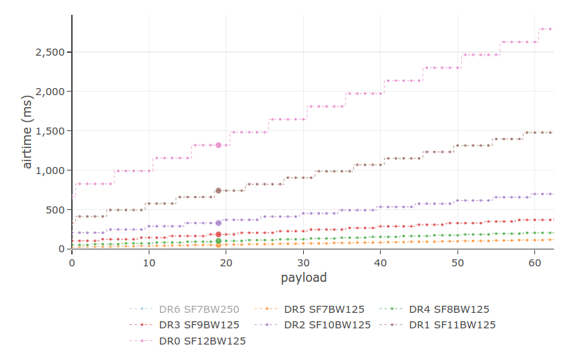

# APRS 434
Welcome to the home of **APRS&nbsp;434**, the 434&nbsp;MHz LoRa APRS amateur radio project that **extends range by saving bytes.**

Unlike other ham radio LoRa APRS projects, this project aims at **deploying LoRa the way it was intended;** namely by being frugal about the number of bytes put on air. Doing so, reaps a number of benefits:

- Increased battery life,
- Higher chances of good packet reception,
- Hence, increased range,
- Lower probability of packet collisions,
- Therefore, more channel capacity.

## Setting an Open Standard for LoRa Frame Compression
As a physical layer, LoRa permits sending any of the [256 characters](https://en.wikipedia.org/wiki/Extended_ASCII) from `\00` to `\ff`. This is double the amount of the [7‑bit, 128 ASCII character set](https://en.wikipedia.org/wiki/ASCII#Character_set). Hence, there are ample opportunities for compressing [AX.25](https://en.wikipedia.org/wiki/AX.25) ([packet radio](https://en.wikipedia.org/wiki/Packet_radio)) unnumbered information (UI) frames at the [data link layer](https://en.wikipedia.org/wiki/Data_link_layer), namely:

|[AX.25](https://en.wikipedia.org/wiki/AX.25) UI frame&nbsp;field|required characters or digits with&nbsp;LoRa|
|:-:|:-:|
|_Flag_|**not required**; provided by LoRa|
|_Destination Address_|**not required**; software version provided by the i‑gate|
|_Source Address_|any 6 out of **37** characters: 26 capital letters + 10 digits + space|
|_SSID_|1 out of [**16** hexadecimal numerals](https://en.wikipedia.org/wiki/Hexadecimal)|
|_Digipeater Address_|1 of [**6** recommended n‑N paradigm paths](#recommended-n-n-paradigm-paths)|
|_Control Field_|**not required**|
|_Protocol ID_|**not required**|
|_Information Field_|up to 256 out of [**95** printable ASCII characters](https://en.wikipedia.org/wiki/ASCII#Printable_characters) first byte = _Data Type ID_|
|_Frame Check Sequence_|**not required**; [FEC](https://en.wikipedia.org/wiki/Error_correction_code#Forward_error_correction)&nbsp;& [CRC](https://en.wikipedia.org/wiki/Cyclic_redundancy_check) are provided by LoRa|
|_Flag_|**not required**|

- _Source Address, SSID_ and _Digipeater Address_ can be compressed into only 5 payload bytes, compared to 25 payload bytes with OE5BPA firmware.
- It is customary to compress latitude, longitude, symbol, course and speed using [Base91](https://en.wikipedia.org/wiki/List_of_numeral_systems#Standard_positional_numeral_systems), which results in another 14 payload bytes; _Data Type ID_ included. **APRS&nbsp;434** will not differ in this respect. There is almost no gain to be made in compressing the _Information&nbsp;Field_ any further.
- If APRS Mic-E compression were to be used instead, that would require another 16 payload bytes to compress latitude, longitude, symbol, course and speed; 7&nbsp;bytes in the superfluous _Destination&nbsp;Address_ and 9&nbsp;bytes in the _Information&nbsp;Field; Data Type ID_ included. Hence, this is not a good option.

## Measurable Benefits
**APRS&nbsp;434** geolocation beacons will encode a total of **only 19 payload bytes** at a time, tremendously **increasing the chances of a flawless reception** by an [**APRS&nbsp;434&nbsp;LoRa&nbsp;i-gate**](https://github.com/aprs434/lora.igate). Other firmware tends to consume about six times as many LoRa payload bytes.

LoRa may receive up to 20&nbsp;dB under the noise floor, but keep in mind that the packet error ratio (PER) as a function of the bit error rate (BER) [increases with the number of transmitted bits](https://en.wikipedia.org/wiki/Bit_error_rate#Packet_error_ratio).

$$PER = 1 - (1 - BER)^n$$

where: $n$ is the number of bits; not bytes.

Due to the LoRa symbol encoding scheme, airtime gains occur in steps of 5&nbsp;bytes when the spreading factor is SF12 and the bandwidth 125&nbsp;kHz. This is depicted as the stepped top trace on the figure below. (Adapted from [[source]](https://avbentem.github.io/airtime-calculator/ttn/eu868/5,14).)

## LoRa Link Parameters
The following LoRa link parameters are commonly in use among amateur radio operators. These appear to be adequate.
- In order to achieve a maximum range, [Semtech](https://en.wikipedia.org/wiki/Semtech) —&nbsp;the company that developed LoRa&nbsp;— recommends selecting the maximum spreading factor $SF = 12$. This corresponds to 12&nbsp;raw bits per symbol. Therefore, each symbol (or frequency chirp) holds $2^{12} = 4096\,\text{chips}$.
- Likewise, the bandwidth is set to the smallest commonly available bandwidth among all LoRa ICs, namely $BW = 125\,\text{kHz}$. This is by definition also the chip rate $R_c = BW$.
- To avoid any further overhead in an already slow mode, the [forward error correction (FEC)](https://en.wikipedia.org/wiki/Error_correction_code#Forward_error_correction) coding rate is kept at $CR = 1$, which corresponds to $\frac{data}{data + FEC} = \frac{4}{5}$.

With these settings, the symbol rate is:

$$R_s = \frac{R_c}{2^{SF}} = \frac{BW}{2^{SF}} = \frac{125\,000}{2^{12}} \approx 30.5\,\text{symbols/s}$$

Whereas the effective data rate $DR$ or bit rate $R_b$ can be calculated as follows:

$$DR = R_b =  \frac{BW}{2^{SF} \SF \frac{4}{4 + CR} = \frac{125\,000}{2^{12}} 12 \frac{4}{5} \approx 293\,\text{bits/s} \approx 36.6\text{byte/s}$$

## Proposed Compression for LoRa Geolocation Frames
Upon succesful demonstration of its merits, below LoRa frame compression procedure will be formally proposed as an extension to the APRS standard.

|_Source Address_|_SSID_ & _Digipeater Address_|_Information Field_|
|:--------------:|:-------------------------------:|:-----------------:|
|4 bytes|1 byte|14 bytes|
|`CCCC`|`D`|`!/XXXXYYYY$csT`|

where:
- `CCCC`: the compressed _Source Address_ (6 character callsign)
- `D`:
  + the compressed _SSID_ (between SSID 0 [none] and 15; included), and
  + the _Digipeater Address_ (between path 0 [none] and 7; included)
- `!`: the _Data Type ID,_ and at the same time a custom, identifiable, positional **LoRa header**
- `/`: the _Symbol Table Identifier_
- `XXXX`: the Base91 compressed longitude
- `YYYY`: the Base91 compressed latitude
- `$`: the _Symbol Code_
- `cs`: the compressed course and speed
- `T`: the _Compression Type Byte_

> **⚠ <u>REFRAIN</u> from adding altitude data when being terrestial. Do not add any other data nor comments!**
>
> Rather, occassionally transmit an uncompressed `>`&nbsp;_Status Report_ with CCCCD callsign compression.

As mentioned before, and when deemed necessary, CCCCD callsign compression can be used in combination with other, mostly uncompressed _Data Types._

### Encoding CCCC
1. Treat the given 6&nbsp;character callsign string as a Base36 encoding. Decode it first to an integer.
2. Then, encode this integer as a 4&nbsp;byte Base256 bytestring.

### Decoding CCCC
1. First, decode the given 4&nbsp;byte Base256 bytestring to an integer.
2. Then, encode this integer as a 6&nbsp;character Base36 string.

### Encoding D
1. First, multiply the _SSID_ integer by&nbsp;16.
2. Then, algebraically add to this the path code digit as listed in below table.
3. Finally, convert the resulting integer to a single Base256 byte.

### Decoding D
1. First, decode the given Base256 byte to an integer.
2. The _SSID_ equals the **integer quotient** after [integer division](https://en.wikipedia.org/wiki/Division_(mathematics)#Of_integers) of the decoded integer by&nbsp;16.
3. Whereas the path code equals the [**remainder**](https://en.wikipedia.org/wiki/Remainder) of the decoded integer by&nbsp;16 ([modulo operation](https://en.wikipedia.org/wiki/Modulo_operation)).

### Codec Algorithms
- [Python3](compression.py) CCCCD compression algorithms and tests
- [MIT License](https://github.com/aprs434/aprs434.github.io/blob/main/LICENSE)

### Recommended n-N paradigm paths

|station|generic digipeating path|path code|
|:-----:|:----------------------:|:-------:|
|no digipeating|[none]|0|
|metropolitan fixed|`WIDE2-1`|1|
|extremely remote fixed|`WIDE2-2`|2|
|metropolitan mobile|`WIDE1-1,WIDE2-1`|3|
|extremely remote mobile|`WIDE1-1,WIDE2-2`|4|
|balloons & aircraft|`WIDE2-1`|5|
|space satellites|`ARISS,WIDE2-1`|6|
|[future use]||7|

Note:
- The first `n` digit in `n-N` paradigm paths indicates the coverage level of the digipeater, whereby `1` is for domestic fill‑in digipeaters and `2` is for county-level digipeaters.
- The second `N` digit indicates the number of repeats at the indicated coverage level.

## ITU Regulation
From a ITU regulatory point of view, long range communication —which, by definition, includes LoRa— is not allowed on ISM (Industrial, Scientific&nbsp;& Medical) bands. ISM&nbsp;bands are intended for local use only.

The amateur radio service forms a sole exception to this, as its 70&nbsp;cm UHF band happens to [overlap](https://hamwaves.com/lpd433/en/index.html#lpd433-channels) the [ITU&nbsp;Region&nbsp;1](https://en.wikipedia.org/wiki/ITU_Region) 434&nbsp;MHz ISM&nbsp;band as a primary service.
Moreover, ham radio is not restricted to a 20&nbsp;dBm (=&nbsp;100&nbsp;mW) power level, nor any 1% duty cycle limits on this band.

As a general rule, secondary users should always check whether a frequency is in use by a primary user before transmitting on air.
However, LoRa has no carrier sensing capability. Therefore, secondary ISM band users lack the ability to check whether an amateur radio operator is using the 434&nbsp;MHz band as a primary user.

## Reducing Power Consumption
1. OLED displays have a limited life span and consume quite a bit of power. An OLED screen and its driver [can be put to sleep](https://bengoncalves.wordpress.com/2015/10/01/oled-display-and-arduino-with-power-save-mode/) when the tracker is idle. The same holds true for the LoRa radio module and the ESP32. This needs to be investigated.
2. GPS modules are also power hogs. It may be conceivable to use the WLAN receiver aboard an ESP32 for localisation, whereby the three strongest WLAN SSIDs are transmitted to the i‑gate. The i‑gate would then guess the tracker location from a freely available [wardriving](https://en.wikipedia.org/wiki/Wardriving) data service from the Internet. This is comparable to how Google Android smartphone localisation works.

## Messaging Pager
Up to now, APRS has been unduly considered to be predominantly a one-way localisation technology. This went to the point that many mistakenly think the letter "P" in the acronym APRS would stand for "position." [Bob Bruninga WB4APR (SK)](http://www.aprs.org), the spiritual father of APRS, deeply resented this situation.

> _"APRS is not a vehicle tracking system. It is a two-way tactical real-time digital communications system between all assets in a network sharing information about everything going on in the local area."_
 
In Bob's view of APRS as being foremost a real-time situational and tactical tool, messaging definitely merits its place.
One of the long-term goals is rendering APRS messaging more popular by offering messaging pager designs.

## Recommended Hardware

### Tracker Hardware:
- TTGO T-Beam 433&nbsp;MHz v0.7 or v1.1
- longer 433&nbsp;MHz antenna with [SMA male](https://en.wikipedia.org/wiki/SMA_connector) connector
- 16.9&nbsp;mm long tiger tail wire soldered to the female SMA socket
- 5&nbsp;V 3&nbsp;A microUSB charge adapter
- Panasonic NCR18650B Li-ion cell, or quality equivalent
- glue gun to stick the GPS antenna to the cell holder
- SH1106 1.3" I²C (4‑pin) OLED display (slightly larger than the usual 0.8" displays often sold with the TTGO T-Beam)
- enclosure

### I-Gate Hardware:
- Either:
  + [TTGO LORA32 433&nbsp;MHz v2](http://www.lilygo.cn/prod_view.aspx?TypeId=50060&Id=1319&FId=t3:50060:3) ([U.FL](https://en.wikipedia.org/wiki/Hirose_U.FL) or [SMA female](https://en.wikipedia.org/wiki/SMA_connector) RF socket), or
  + maybe Heltec ESP32 LoRa 433&nbsp;MHz **v2** ([U.FL](https://en.wikipedia.org/wiki/Hirose_U.FL) female RF socket); subject to satisfactory receiver testing
  + **⚠ <u>DO NOT USE</u>** Heltec ESP32 LoRa 433&nbsp;MHz **v1** as it is as deaf as a post!
- 70&nbsp;cm amateur radio colinear groundplane antenna with coaxial cable and connectors
- 16.9&nbsp;mm long tiger tail wire soldered to the RF socket
- 5&nbsp;V 1&nbsp;A microUSB power supply
- enclosure

## ESP32 Firmware Downloads

### Tracker Firmware
See: <https://github.com/aprs434/lora.tracker>

Please, note that the [`tracker.json`](https://github.com/aprs434/lora.tracker/blob/master/data/tracker.json) configuration file has been much simplified.

### I-Gate Firmware
See: <https://github.com/aprs434/lora.igate>

> Currently, the APRS&nbsp;434 tracker is still compatible with the i-gate developed by Peter Buchegger, OE5BPA. However, this will soon change as more LoRa frame compression is added.
>
> We feel confident that trackers with the proposed APRS&nbsp;434 compressed LoRa frame will eventually become dominant because of the longer range merit. To smooth out the transition, we are developing an **i‑gate capable of understanding both formats;** i.e. compressed APRS&nbsp;434&nbsp;and longer, legacy OE5BPA.
>
> It is strongly advised to install [**the accompanying APRS&nbsp;434 i-gate**](https://github.com/aprs434/lora.igate) as new releases will be automatically pulled over‑the‑air (OTA) via WiFi.

## Development Road Map

### Data Link Layer

|tracker firmware|completed|feature|LoRa payload|compatible with OE5BPA i‑gate|
|:------------------:|:-------:|:-----:|:----------:|:---------------------------:|
|v0.0.0|✓|original [OE5BPA tracker](https://github.com/lora-aprs/LoRa_APRS_Tracker)|113 bytes|✓|
|v0.1.0|✓|byte-saving [`tracker.json`](https://github.com/aprs434/lora.tracker/blob/master/data/tracker.json)|87 bytes|✓|
|v0.2.0|✓|fork of the [OE5BPA tracker](https://github.com/lora-aprs/LoRa_APRS_Tracker) with significantly less transmitted&nbsp;bytes|44 bytes|✓|
|v0.3.0|✓|[Base91](https://en.wikipedia.org/wiki/List_of_numeral_systems#Standard_positional_numeral_systems) compression of  location, course&nbsp;and speed&nbsp;data|31 bytes|✓|
|[v0.4.0](https://github.com/aprs434/lora.tracker)|✓|removal of the transmitted [newline](https://en.wikipedia.org/wiki/Newline) `\n`&nbsp;character at&nbsp;frame&nbsp;end|30 bytes|✓|
|||random time jitter between fixed interval packets to&nbsp;avoid repetitive&nbsp;[collisions](https://en.wikipedia.org/wiki/Collision_domain)|30 bytes|✓|
|||[tracker](https://github.com/aprs434/lora.tracker) and [i-gate](https://github.com/aprs434/lora.igate) with frame&nbsp;address&nbsp;compression, no custom&nbsp;header in&nbsp;payload|20 bytes|use the [APRS&nbsp;434 i‑gate](https://github.com/aprs434/lora.igate)|

> Currently, the APRS&nbsp;434 tracker is still compatible with the i-gate developed by Peter Buchegger, OE5BPA. However, this will soon change as more LoRa frame compression is added.
>
> We feel confident that trackers with the proposed APRS&nbsp;434 compressed LoRa frame will eventually become dominant because of the longer range merit. To smooth out the transition, we are developing an **i‑gate capable of understanding both formats;** i.e. compressed APRS&nbsp;434&nbsp;and longer, legacy OE5BPA.
>
> It is strongly advised to install [**the accompanying APRS&nbsp;434 i-gate**](https://github.com/aprs434/lora.igate) as new releases will be automatically pulled over‑the‑air (OTA) via WiFi.

### Tracker Hardware

|tracker firmware|completed|feature|
|:------------------:|:-------:|:-----:|
|v0.3.1|✓|coordinates displayed on screen|
|||reduced power consumption through [SH1106 OLED sleep](https://bengoncalves.wordpress.com/2015/10/01/oled-display-and-arduino-with-power-save-mode/)|
|||button press to activate OLED screen|
|||ESP32 power reduction|

### Messaging
At first, only uplink messaging to an i-gate will be considered. This is useful for status updates, [SOTA self‑spotting](https://www.sotaspots.co.uk/Aprs2Sota_Info.php), or even emergencies.

On the other hand, bidirectional messaging requires time division multiplexing between the up- and downlink, based on precise GPS timing. That is because channel isolation between different up- and downlink frequencies probably would require costly and bulky resonant cavities.

|tracker firmware|completed|feature|
|:------------------:|:-------:|:-----:|
|||add a [library](https://web.archive.org/web/20190316204938/http://cliffle.com/project/chatpad/arduino/) for the [Xbox 360 Chatpad](https://nuxx.net/gallery/v/acquired_stuff/xbox_360_chatpad/) keyboard|
|||[support](https://www.hackster.io/scottpowell69/lora-qwerty-messenger-c0eee6) for the [M5Stack CardKB Mini](https://shop.m5stack.com/products/cardkb-mini-keyboard) keyboard|

### WiFi Geolocation
TBD

## News, Social & Codevelopment
Feel free to join our public [**Telegram Group**](https://t.me/aprs434) for the latest news and cordial discussions.

You are invited to contribute code improvements to [**this project on GitHub**](https://github.com/aprs434).
Here is a lightweight [video introduction to using GitHub](https://youtu.be/tCuPbW31vAw) by Andreas Spiess, HB9BLA.

